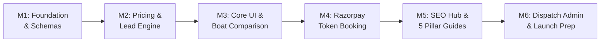

# 🚀 Master Implementation Plan: `munroe-island.in`

> **Target Domain:** `munroe-island.in`  
> **Architecture:** Next.js 15 (App Router) + Tailwind CSS + Sanity CMS + Neon PostgreSQL (Prisma) + Razorpay  
> **Execution Strategy:** 6 sequential, testable milestones over 6–8 weeks

---



---

## Milestone 1: Foundation & Data Infrastructure
*Estimated Duration: Week 1*

### 1.1 Project Initialization & Design Tokens
- Bootstrap Next.js 15 (App Router) with TypeScript & ESLint in the workspace.
- Configure Tailwind CSS with a **Nature-Immersive palette**:
  - `brand-forest`: `#12372A` (deep Kerala canal green)
  - `brand-lagoon`: `#1B4242` (backwater teal)
  - `brand-sand`: `#FBF9F1` (warm background neutral)
  - `brand-sun`: `#E07A5F` (sunset coral accent for CTAs)
- Setup Google Fonts with zero CLS (`Fraunces` or `Outfit` for warm display headings; `Plus Jakarta Sans` for body).

### 1.2 Database & Transactional Models (Prisma + Neon PostgreSQL)
- Setup Prisma client and connection to serverless PostgreSQL.
- Implement the core transactional models:
  ```prisma
  model Booking {
    id              String        @id @default(cuid())
    bookingNumber   String        @unique // e.g. MNI-2026-1042
    customerName    String
    customerPhone   String
    customerEmail   String?
    boatType        BoatType      // CANOE, SHIKARA, KAYAK
    tourName        String        // e.g. "Sunrise 2.5h Canal Tour"
    date            DateTime
    timePreference  TimeSlot      // SUNRISE, MORNING, AFTERNOON, SUNSET
    adultsCount     Int
    childrenCount   Int           @default(0)
    totalAmount     Float
    tokenAmount     Float         // 25% of total
    remainingAmount Float         // 75% payable at jetty
    paymentStatus   PaymentStatus @default(PENDING) // PENDING, PAID, REFUNDED
    status          BookingStatus @default(RECEIVED)// RECEIVED, ASSIGNED, COMPLETED, CANCELLED
    razorpayOrderId String?
    razorpayPaymentId String?
    assignedOperator String?      // Operator name/contact for manual routing
    notes           String?
    createdAt       DateTime      @default(now())
    updatedAt       DateTime      @updatedAt
  }

  enum BoatType { CANOE, SHIKARA, KAYAK }
  enum TimeSlot { SUNRISE, MORNING, AFTERNOON, SUNSET }
  enum PaymentStatus { PENDING, PAID, REFUNDED }
  enum BookingStatus { RECEIVED, ASSIGNED, COMPLETED, CANCELLED }
  ```

### 1.3 Editorial Content Modeling (Sanity CMS)
- Setup embedded Sanity Studio (`/admin/studio`).
- Define structured schemas:
  - `experience`: Title, slug, boatType, duration, canalAccess (boolean), highlights, routeDescription, basePrice, extraPaxPrice, gallery images.
  - `guideArticle`: Title, slug, metaDescription, canonicalTag, body (PortableText), publishedAt, author.
  - `siteSettings`: Global WhatsApp number, emergency hotline, default notice banner.

---

## Milestone 2: Pricing Engine & Dual Inquiry System
*Estimated Duration: Week 2*

### 2.1 Dynamic Pricing Calculation Engine
- Pure, unit-tested pricing module:
  - **Canoe:** Base rate (covers 2 pax) + extra pax surcharge (up to 4–5 max).
  - **Shikara:** Base rate (covers 4 pax) + extra pax surcharge (up to 8 max).
  - **Kayak:** Rate per person multiplied by participant count.
  - Computes `totalAmount`, `tokenAdvance` (25%), and `balanceOnArrival` (75%).

### 2.2 Dual-Action Lead Routing
- **Online Token Path:** Validates form payload with Zod and generates a draft order.
- **WhatsApp Direct Path:** Client-side URL builder converting selected date, boat type, guests, and preferred slot into a pre-formatted message:
  > *"Hello Munroe Island! I'd like to book a 2.5-hour Sunrise Canoe Tour for 2 people on 18th Oct. Estimated fare: ₹1,600. Please let me know availability."*

---

## Milestone 3: Core UI & Unique Differentiator Components
*Estimated Duration: Weeks 3–4*

### 3.1 Global Layout & Trust Shell
- Responsive Header with quick phone/WhatsApp trigger and "Check Availability" CTA.
- Sticky Mobile Action Bar: "Chat on WhatsApp" (50% width) + "Book Online" (50% width).
- Trust Badge Bar: *100% Life Jackets Guaranteed • Experienced Native Boatmen • Transparent Jetty Pricing • Verified Route Access*.

### 3.2 Key Homepage & Boating Experience Components
1. **Interactive Boat Comparison Tool (The Core Differentiator):**
   - Side-by-side card comparison between Canoe, Shikara, and Kayak.
   - Highlights: Can it enter narrow mangrove tunnels? (Yes/No), Seating posture, best photography slot.
   - Clear advisory notice: *"Planning to see narrow canals? Choose Canoe or Kayak. Houseboats cannot enter narrow waterways."*
2. **Hero Search & Quick Quote Widget:**
   - Date picker + Boat type dropdown + Guest counter with instant live price preview.
3. **Canal Route Visualizer:**
   - Mapbox / SVG interactive map showing narrow canal paths (green trail) vs. Ashtamudi lake cruise path (blue trail).
4. **Curated Photo Gallery:**
   - Real, enhanced photos of actual Munroe Island canals, wooden canoes, and sunrise reflections.

---

## Milestone 4: Razorpay Token Checkout & Booking Pipeline
*Estimated Duration: Week 5*

### 4.1 Payment Gateway Integration
- Implement `/api/checkout/create-order` endpoint communicating with Razorpay Orders API.
- Embedded Razorpay Standard Checkout modal handling UPI (GPay, PhonePe, Paytm), NetBanking, and Cards.
- `/api/checkout/verify-payment` webhook validating Razorpay cryptographical signature and updating database status.

### 4.2 Booking Confirmation & Notifications
- Dynamic Booking Success Page (`/booking/confirmation/[bookingNumber]`) showing:
  - Confirmed reservation slip with QR code / reference ID.
  - Payment breakdown (Token paid: ₹400 | Due at Jetty: ₹1,200).
  - Clear next step: *"Our team will contact you on WhatsApp with your boatman's contact and jetty meeting point within 2–4 hours."*
- Transactional email dispatch via **Resend** including `.ics` calendar event file.

---

## Milestone 5: SEO Content Hub & 5 Launch Pillar Guides
*Estimated Duration: Week 6*

### 5.1 Technical SEO Architecture
- JSON-LD structured data generators:
  - `TouristAttraction` for the Island destination.
  - `BoatTrip` & `Offer` for each tour package.
  - `FAQPage` on all major landing pages for Google snippet rankings.
  - `BreadcrumbList` for clean Google hierarchy display.
- Dynamic `sitemap.ts` and `robots.ts` rendering all static routes and CMS-published articles.

### 5.2 The 5 Launch Pillar Articles
1. **Guide 1:** `munroe-island-boating-rates-timings` (Search intent: Transactional price research).
2. **Guide 2:** `canoe-vs-shikara-vs-kayak-which-boat-to-choose` (Search intent: Decision guidance).
3. **Guide 3:** `how-to-reach-munroe-island-kollam-varkala` (Search intent: Travel logistics).
4. **Guide 4:** `one-day-munroe-island-itinerary` (Search intent: Trip planning).
5. **Guide 5:** `best-time-to-visit-munroe-island-seasons-tides` (Search intent: Weather & seasonal research).

---

## Milestone 6: Operator Dispatch Admin & Launch Checklist
*Estimated Duration: Week 7*

### 6.1 Lightweight Internal Dispatch View (`/admin/bookings`)
- Simple authentication for your internal team.
- Tabular dashboard with filters: *Today's Trips*, *Pending Operator Assignment*, *Confirmed*, *Completed*.
- **"Dispatch to Boatman" Action Button:** Generates a pre-composed Malayalam / English message with tourist name, pickup time, and remaining cash amount to send to your local boatman with one click.

### 6.2 Pre-Launch & Go-Live Checklist
- [ ] Connect custom domain `munroe-island.in` on Vercel with SSL.
- [ ] Setup Google Search Console & submit sitemap.
- [ ] Setup Google Analytics 4 with conversion event tracking for `token_paid` and `whatsapp_lead`.
- [ ] Verify Core Web Vitals on mobile (LCP < 2.5s, CLS < 0.05).
- [ ] Test end-to-end Razorpay sandbox and live ₹1 test transaction.
